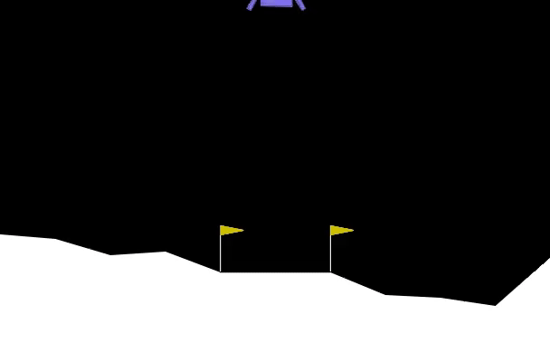

# 🚀 Lunar Lander Simulation
A physics-based simulation of the classic Lunar Lander problem using **Gymnasium** & **Box2D**. Watch a rocket autonomously navigate treacherous terrain, applying intelligent thrust control to achieve a safe landing — or crash in style! This repo includes a pre-recorded video demo and a fully functional, customizable simulation script.

---

## 🎥 Demo Video

Click to watch the lander in action (auto-generated by the script):

[▶️ lunar_lander_simulation.gif](./lunar_lander_simulation.gif)


---

## 📂 Files Included

| File                             | Description                                                                 |
|----------------------------------|-----------------------------------------------------------------------------|
| `lunar_lander.py`                | Main simulation script (includes heuristic agent & automatic video capture)|
| `lunar_lander_simulation.mp4`    | Recorded simulation showcasing the lander’s performance                    |
| `README.md`                      | This file — setup instructions, features, and project overview             |

---

## ⚙️ Features

- 🌌 **Fully Simulated Environment** – Built using Gymnasium and Box2D physics.
- 🧠 **Heuristic Agent** – Controls the lander using dynamic calculations based on position, velocity, and tilt.
- 🎥 **Automatic Video Recording** – The simulation is rendered and saved as an MP4 using MoviePy.
- 🎮 **Realistic Controls** – Simulates main and side thrusters, gravitational pull, and wind (optional).
- ⚡ **Customizable Parameters** – Gravity, wind strength, and engine powers can be adjusted in `lunar_lander.py`.

---

## 💻 How to Run Locally

### 1. Clone This Repository
```bash
git clone https://github.com/yourusername/lunar-lander-simulation.git
cd lunar-lander-simulation
```

### 2. Create a Virtual Environment (Optional but Recommended)
```bash
python -m venv env
source env/bin/activate  # macOS/Linux
env\Scripts\activate     # Windows
```

### 3. Install Dependencies
```bash
pip install gymnasium[box2d] pygame moviepy
```

### 4. Run the Simulation Script
```bash
python lunar_lander.py
```

📦 **Output**: After running, the simulation will automatically save a video named `lunar_lander_simulation.mp4` in the same directory.

---

## 📊 How It Works

- The script initializes a **Lunar Lander environment** with a customizable render mode (`rgb_array` for video recording).
- A **heuristic agent** calculates optimal actions based on the current state:
  - Horizontal/vertical position & speed
  - Rotation angle & angular velocity
  - Ground contact of landing legs
- **Rewards** are calculated for safe landings, reduced tilt, slower descent, and minimal fuel usage.
- The simulation loop renders each frame, collects observations, and logs progress.
- After termination (safe landing or crash), the recorded video is saved automatically.

---

## 🧩 Customization Tips

You can tweak the simulation behavior by editing these variables in `lunar_lander.py`:
- `gravity`: Adjust gravitational pull (e.g., Moon: -1.62, Earth: -9.8)
- `wind_power`, `turbulence_power`: Simulate environmental effects
- `MAIN_ENGINE_POWER`, `SIDE_ENGINE_POWER`: Modify thrust strength
- `FPS`, `SCALE`: Control simulation speed and resolution

---

## 🛰️ Example Use Cases

- Reinforcement Learning Environment for AI training
- Physics and trajectory visualization for educational purposes
- Showcase project for simulations and heuristic optimization

---

## 🌟 Star This Project

If you find this project interesting or helpful, feel free to ⭐ star the repo — it helps others discover it too!
